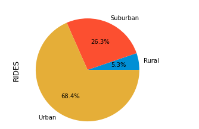
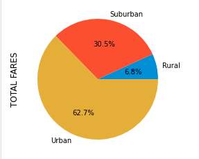
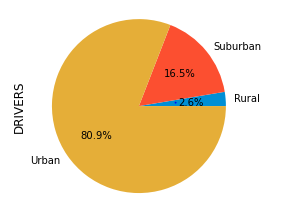
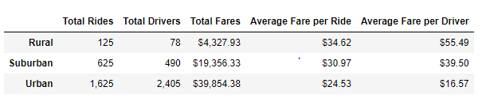
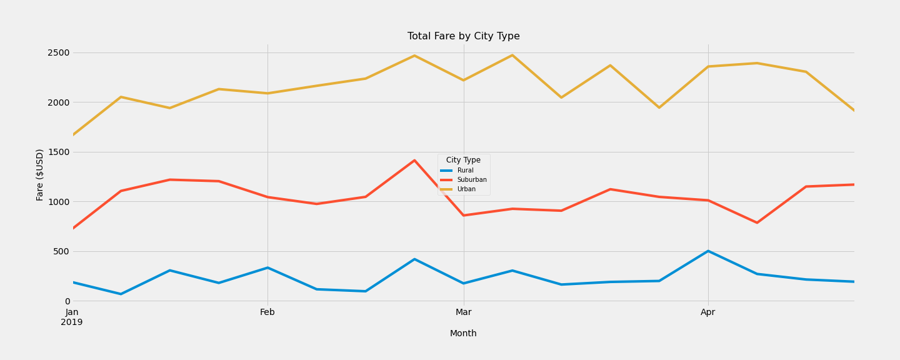

### PyBer_Analysis

Perform an analysis with visualizations of the relationship between rides, drivers and fares within rural, suburban and urban categories or Types of cities. This was required to be implemented using Pandas and Matplotlib to ultimately show the total weekly fares for each city type. The output will provide information to decision-makers on how to organize or manage ride shares to an optimum capacity.

### Results

####  RIDES

Rides in Urban cities were the most coming in at 68.4%
Rides in Suburban at 26.3%
Rides in Rural at 5.3%

#### REVENUE

From the rides section above, the number of rides was greatest in Urban, the revenue was greatest totaling $39,854, with urban and rural being around $19,356 and $4,327

#### DRIVERS

Urban cities had 2,405 drivers in urban cities, 490 drivers in suburban, and 78 drivers in rural cities

### Summary

In addition the Ride-Sharing summary Dataframe above, multi-three-line chart provides trends of total fares in rural, suburban, and urban cities between 2019-01-01 through 2019-04-28.

- The yellow trend line graph for Urban shows The yellow trend shows how fares in urban cities totaled from around $1,600 to $2,300 from beginning to end during this five-month period
- The blue trend line graph shows how fares in rural cities totaled around $300 from beginning to end during the same time period.
- The orange trend line graph shows how the total fares in suburban cities fall in between urban and rural cities: around $700 to $1,300 from beginning to end during this time.

As an overall observation, the maximum fares are realized round the end of February.  Perhaps it was the hedgehog's prediction of a warmer spring. 

<u>Three Business Recommendations</u>

1. The peak time for revenue generation is end of February. Resource in terms of drivers and their vehicles should be maximized to achieve this demand. 

2. Resources should be shifted from Rural and Suburban cities if feasible to contribute in Feb-March to the additional demand in Urban Cities. It requires a real time logistics and Resources pooling system to satisfy a Just In time (JIT) strategy. 

3. Drivers and their vehicles should be hired with an understanding that they could be willing and flexible to work in Urban cities during that areas peak times.

   There are many considerations to implementing these recommendations. Multi state or city  insurance, wage and fare adjustments as a driver moves from city to another, and finally licensing and adherence to city ordinances for ride sharing.

# 

